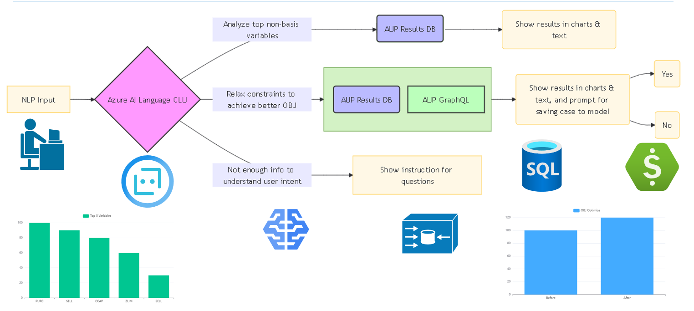

# Team 11: AI Assistant for AUP Economic Analysis
- Interactive AI Assistant (Conversational Language Understanding) to understand user request
- Visualize key constraints and provide intelligence advise based on NLP input

## Overview



## Business Value

- Improve planning quality by identifying key constraints instantly with AI assistant

- Reduce expertise level required to create, run and analysis complex plant model

## Setup

### Setting up Azure AI Language CLU project

- Create an Azure AI Language Resource

-  Sign in to Language Studio, find Conversational Language Understanding projects sections. Import a project from our provided AIAssistant_CLU_project.json file.

- Open the imported project, start a training, deploy a model
 
- Integrate CLU model into AIAssistant project

-  Configure the Azure language endpoint URL, KEY, CLU project name, and deploy name in Web.config
 
 
### Add queries and stored procedures into AUP results DB.

- Run SQL Server Studio Management, open AddViewsAndSPtoAUPResults.sql, set your target database to your AUP results DB, execute the script.
- Configure AUP results DB connection in Web.config


### Change webServer security settings

- Open file ".vs\AIQuestionAnswer\config\applicationhost.config"  
Replace

    ```xml
    <section name="anonymousAuthentication" overrideModeDefault="Deny" />
    ```
    with 
    ```xml
    <section name="anonymousAuthentication" overrideModeDefault="Allow" />
    ```
    Replace
    ```xml
    <section name="windowsAuthentication" overrideModeDefault="Deny" />
    ```
    with 
    ```xml
    <section name="windowsAuthentication" overrideModeDefault="Allow" />
    ```

### Build release web application

- Open command line, go to directory: Vue3-WebApplication, run command

    ```  
    npm install
    npm run build
    run powershell script replaceIndexCshtml.ps1
    ```

